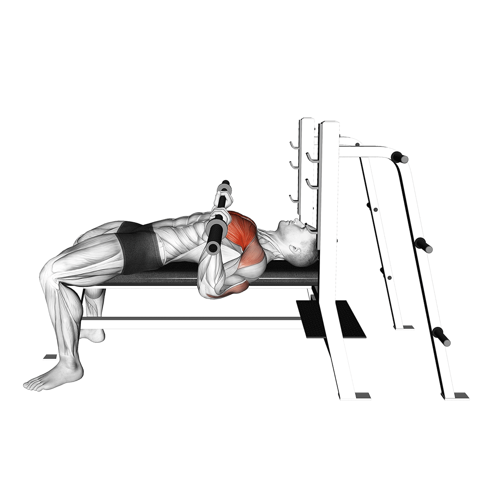
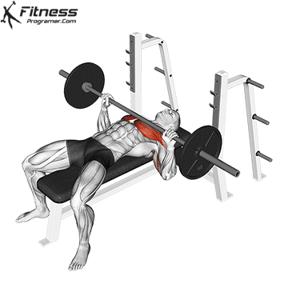

+++
title = 'Обо мне'
date = 2025-06-08T22:48:12+03:00
draft = true
+++

# Разминка

Оптимальная продолжительность разминки — 10–15 минут. Рекомендуется выполнять упражнения в следующей последовательности:

**1. Кардио разминка (5 минут)**

- Лёгкий бег на месте или на беговой дорожке.
- Прыжки на скакалке.
- Быстрая ходьба.

Цель: повысить частоту сердечных сокращений и разогреть мышцы.

**2. Суставная гимнастика (3–5 минут)**

- Шея: наклоны вперёд, назад, в стороны; повороты вправо и влево.
- Плечи: круговые движения вперёд и назад.
- Локти и кисти: вращения в суставах.
- Тазобедренные суставы: круговые движения тазом.
- Колени: вращения в согнутом положении.
- Голеностопы: вращения стопами.

Цель: улучшить подвижность суставов и подготовить их к нагрузке.

**3. Динамическая растяжка (3–5 минут)**

- Наклоны к носкам: стоя, ноги на ширине плеч, наклоны вперёд.
- Махи ногами: вперёд, назад и в стороны.
- Выпады: вперёд с чередованием ног.
- Боковые выпады: с переносом веса тела.

Цель: повысить эластичность мышц и подготовить их к работе.

**4. Специальные упражнения (2–3 минуты)**

- Приседания с собственным весом.
- Отжимания от пола или с упором на скамью.
- Смена пассивного на активный вис на турнике или с гравитроном для подготовки к подтягиваниям.

Цель: активировать целевые мышцы перед основной тренировкой.

# Упражнения на грудь

---

## Жим штанги лёжа

Мышцы: грудные, передние дельты, трицепсы.

**Техника выполнения**
1. Исходное положение:
    - Лягте на скамью, стопы плотно стоят на полу.
    - Возьмитесь за штангу средним или чуть шире среднего хватом, ладони смотрят вперёд.
2. Выполнение:
    - На вдохе плавно опустите штангу к середине груди, локти под углом ~75°–90°.
    - На выдохе выжмите штангу вверх, не блокируя локти в верхней точке.

**Ошибки**
- Отрыв пяток от пола.
- Опускание штанги слишком высоко (к шее) или низко (к животу).
- Резкие движения и рывки.
- Чрезмерный прогиб в пояснице.

## Жим в тренажёре (грудной жим)

Мышцы: грудные, передние дельты, трицепсы.

![[14551103-Lever-Chest-Press-VERSION-2_Chest_360.gif|500]]

**Техника выполнения**

1. Исходное положение:
    - Сядьте в тренажёр, спина прижата к спинке, ноги стоят на полу.
    - Возьмитесь за рукояти, локти под углом 75°–90°.
2. Выполнение:
    - На выдохе плавно выжмите рукояти вперёд до полного разгибания рук.
    - На вдохе медленно верните рукояти в исходное положение.

**Ошибки**
- Отрыв спины от спинки тренажёра.
- Слишком глубокий уход рук за спину при возврате.
- Использование инерции и резкие движения.
- Чрезмерное разгибание локтей в верхней точке.

# Упражнения на руки

---

## Скручивание бицепса с низкой тягой

Мышцы: бицепс, предплечья.

![[08681301-Cable-Curl-m_Upper-Arms_360.gif|500]]
### Техника выполнения
1. Исходное положение:
    - Встаньте лицом к блочному тренажёру, установив рукоять на нижний блок.
    - Возьмитесь за рукоять подъёмным (супинированным) хватом, ладони вверх.
    - Спина прямая, корпус не раскачивается.
2. Выполнение:
    - На выдохе согните руки в локтях, поднимая рукоять к плечам.
    - В верхней точке задержитесь на секунду, сильно напрягая бицепс.
    - На вдохе медленно опустите рукоять обратно, контролируя движение.

### Ошибки:
- Рывки и инерция.
- Движение корпусом (завал вперёд-назад).
- Неполная амплитуда (не до конца разгибаете или сгибаете руки).

## Разгибание рук с верхнего блока (Тяга на трицепс)

Мышцы: трицепс, предплечья.

![[triceps-na-polia-alta.gif|500]]
### Техника выполнения

1. Исходное положение:
    - Встаньте лицом к блочному тренажёру, установив рукоять на верхний блок.
    - Возьмитесь за рукоять прямым хватом (ладони вниз), локти прижаты к корпусу.
    - Корпус слегка наклонён вперёд, но спина остаётся прямой.
2. Выполнение:
    - На выдохе полностью разогните руки вниз, напрягая трицепс.
    - В нижней точке зафиксируйте положение на секунду.
    - На вдохе медленно верните рукоять обратно, сохраняя контроль.

### Ошибки:
- Разведение локтей в стороны.
- Использование корпуса и раскачивание.
- Чрезмерное расслабление в верхней точке.

# Упражнения на спину
---
## Тяга нижнего блока к поясу

Мышцы: широчайшие, ромбовидные, задняя дельта, трапеции, бицепсы.

![[GWtvzgiwJBuDQmS0-16-1-1.gif]]

### Техника выполнения
1. Исходное положение:
    - Сядьте, упритесь ногами в платформу, колени слегка согнуты.
    - Возьмитесь за рукоятку нейтральным (ладони друг к другу) или прямым хватом.
    - Спина ровная, грудь слегка подана вперёд.
2. Выполнение:
    - На выдохе плавно тяните рукоятку к поясу, сводя лопатки.
    - Локти идут вдоль корпуса, без разведения в стороны.
    - На вдохе медленно и контролируемо возвращайте рукоятку обратно.

### Ошибки:
- Округление спины — перегрузка позвоночника.
- Рывки и инерция — снижают нагрузку на спину.
- Недостаточное сведение лопаток — теряется эффективность.

## Тяга верхнего блока к груди

Мышцы: широчайшие, трапеции, ромбовидные, бицепсы.

![[Вертикальная-тяга-Выполнение.gif]]

### Техника выполнения
1. Исходное положение:
    - Сядьте, зафиксируйте колени под валиком.
    - Возьмитесь за рукоять широким или средним хватом.
2. Выполнение:
    - На выдохе плавно тяните рукоять вниз к груди, сводя лопатки.
    - В конечной точке задержитесь на секунду.
    - На вдохе медленно верните рукоять вверх.

### Ошибки:
- Округление спины.
- Рывки и использование инерции.
- Неполная амплитуда движения.

## Подтягивания широким хватом на турнике и в гравитроне

![[18661301-Wide-Grip-Pull-Up-on-Dip-Cage_Back_720.gif]]
### Цели

Подтягивания широким хватом направлены на укрепление и развитие следующих мышечных групп:​

- Широчайшие мышцы спины: основная нагрузка приходится на верхнюю часть этих мышц, способствуя формированию широкой спины.​    
- Трапециевидные мышцы: участвуют в стабилизации и движении лопаток.​
- Мышцы рук: бицепсы и предплечья получают вспомогательную нагрузку.​

Регулярное выполнение этого упражнения способствует улучшению осанки, увеличению силы верхней части тела и подготовке к более сложным движениям.​

### Техника выполнения на турнике

1. **Исходное положение**
    - Подойдите к турнику и возьмитесь за перекладину прямым хватом (ладони обращены от себя) на расстоянии примерно 20–25 см шире плеч.​
    - Повисните на турнике, полностью выпрямив руки и расслабив тело.​
2. **Подтягивание**:
    - На выдохе начните подтягиваться, сводя лопатки и направляя локти вниз и назад.
    - Поднимайтесь до тех пор, пока подбородок не окажется на уровне или чуть выше перекладины.​
3. **Возвращение в исходное положение**:
    - На вдохе медленно опуститесь, контролируя движение, до полного выпрямления рук.​
    - Избегайте рывков и раскачиваний; движение должно быть плавным и подконтрольным.​

>[!NOTE] Вспомогательная помощь на турнике с помощью резинки
>Для этого её нужно сначала подобрать: чем толще и плотнее резинка, тем больше она помогает (мне скорее всего подойдет резинка шириной 30 мм).
>
>Далее резинку нужно закрепить, перекинув резинку через перекладину турника и продеть один конец через другой, затянув узел, чтобы получилась петля.​ И поставив одну или обе ступни (или колени) в петлю резинки, чтобы она натянулась и поддерживала ваш вес.
>
>Остальное делать как при обычных подтягиваниях.
### Техника выполнения в гравитроне

1. **Настройка тренажёра**:
    - Установите необходимый вес противовеса в соответствии с вашей подготовкой.​
2. **Исходное положение**:
    - Встаньте на подвижную платформу тренажёра, поставив колени на неё.​
    - Возьмитесь за рукоятки широким хватом, спина прямая, взгляд вперёд.​
3. **Подтягивание**:
    - На выдохе подтянитесь, сводя лопатки и направляя локти вниз и назад, пока подбородок не достигнет уровня рукояток.​
4. **Возвращение в исходное положение**:
    - На вдохе медленно опуститесь, контролируя движение, до полного выпрямления рук.

# Упражнения на ягодицы
---
## Мостик с отягощением (глют-бридж)

Мышцы: ягодичные, задняя поверхность бедра, мышцы корпуса.

![[ezgif-1-fdc77aee51-site.gif]]

### Техника выполнения
1. Исходное положение:
    - Лягте на спину, ноги согнуты, стопы на полу.
    - Положите штангу или гантель на бедра.
2. Выполнение:
    - На выдохе поднимите таз вверх, напрягая ягодицы.
    - В верхней точке зафиксируйтесь на 1–2 секунды.
    - На вдохе плавно опустите таз вниз.

### Ошибки:
- Слабое напряжение ягодиц.
- Чрезмерное прогибание поясницы.
- Опускание таза слишком низко.

# Упражнения на пресс
---
## Скручивания на тренажёре для пресса

Мышцы: прямая мышца живота.

![[Тренажер-для-пресса-Выполнение.gif]]

### Техника выполнения
1. Исходное положение:
    - Сядьте, зафиксируйте ноги.
    - Возьмитесь за рукояти или скрестите руки на груди.
2. Выполнение:
    - На выдохе согните корпус, сокращая пресс.
    - На вдохе плавно вернитесь в исходное положение.

### Ошибки:
- Напряжение шеи.
- Использование инерции.
- Недостаточная амплитуда движения.

# Упражнения на ноги
---
## Бег

Мышцы: квадрицепсы, икроножные, ягодичные, мышцы кора.

![[Pasted image 20250318141828.png]]
### Техника выполнения

1. Исходное положение:
    - Держите корпус прямо, слегка наклоняясь вперёд.
    - Руки согнуты под углом 90°, двигаются в такт шагам.
    - Ступни ставьте мягко на переднюю или среднюю часть стопы, избегая удара пяткой.
2. Выполнение:
    - Бегите в естественном темпе, не заваливаясь вперёд или назад.
    - Дыхание:
        - Спокойный темп: дыхание через нос (вдох на 2–3 шага, выдох на 2–3 шага).
        - Интенсивный бег: вдох носом, выдох ртом (вдох на 2 шага, выдох на 1–2 шага).

### Ошибки:
- Округление спины или завал плеч вперёд.
- Жёсткое приземление на пятку.
- Поверхностное или прерывистое дыхание.
- Излишняя напряжённость в плечах и руках.

## Жим ногами в тренажёре

Мышцы: квадрицепсы, ягодицы, задняя поверхность бедра.

![[Упражнение-жим-ногами.gif]]

### Техника выполнения
1. Исходное положение:
    - Сядьте, поставьте ноги на платформу.
2. Выполнение:
    - На выдохе выжмите платформу вверх.
    - На вдохе медленно опустите её вниз.

### Ошибки:
- Блокировка коленей в верхней точке.
- Отрывание поясницы от спинки.
- Недостаточная глубина опускания.

# Заминка
---

![[stretching-exercises-chart.jpg]]

Сколько выполнять каждое упражнение:

- Растяжка на 3 минуты: по 10 секунд на каждую сторону
- Растяжка на 5 минут: по 15 секунд на каждую сторону
- Растяжка на 7 минут: по 20 секунд на каждую сторону

Это значит, что вы выполняете, например, наклон головы в правую сторону 10/15/20 секунд, затем наклон головы в левую сторону 10/15/20 секунд, затем переходите к следующему упражнению. Если упражнение на одну сторону, то выполняете его целиком те же 10/15/20 секунд.

## Наклоны головы в стороны

![[neck-stretch.jpg]]

### Цели
Мускулатура шеи – лестничные пучки (передний, задний и средний), сосцевидная, грудино-ключичная. Меньше тянется ременная мышца.

### Техника
1. Встаньте прямо, расставьте стопы на ширину плеч и вытяните руки вдоль корпуса.
2. Взгляд направьте четко вперед, шею не сгибайте.
3. Закиньте правую руку поверх головы, обхватите ладонью с левого бока.
4. Слегка надавите и плавно опустите голову к правому плечу. Движение идет в одной плоскости с корпусом.
5. Ощутите натяжение в мышцах.
6. Повторите в другую сторону.

## Растяжка плеч с поворотом руки

![[Across-Chest-Shoulder-Stretch.gif]]
### Цели
Дельтовидные мышцы, по большей части, средний, задний пучок. Включается вращательная манжета, косвенно трицепсы и бицепсы рук.

### Техника
1. Примите классическую стойку – корпус прямо, руки по швам, стопы на ширине плеч.
2. Смотрите вперед.
3. Правую руку поднимите перед собой, доведя до параллели с полом, затем через грудь поверните в левую сторону так, чтобы предплечье оказалось у плеча.
4. Второй рукой обхватите локоть, помогите растянуть мышцы.
5. Корпус при этом не разворачивайте, держите неподвижно.

## Растяжка бицепсов и предплечий

![[Wall-bicep-stretch-.gif]]

### Цели
Грудь, плечи и руки

### Техника
1. Прижмите левую ладонь к стене или прочному предмету.
2. Медленно поверните тело в сторону от стены.
3. Почувствуйте растяжение в груди, плече и руке.
4. Задержитесь в этом положении на `n` секунд.
5. Повторите на противоположной стороне.

## Растяжка трицепсов

![[triceps-stretch.gif|500]]
### Цели
Трехглавые пучки (трицепсы) рук. Менее активно в работу подключаются дельтовидные, шейные и верхние спинные мышцы, бицепсы.

### Техника
1. Примите обычную стойку – корпус прямой, руки вдоль тела, а ноги на ширине плеч.
2. Одну руку поднимите ровно вверх, затем согните в локте, опустите вниз ладонью на место между лопатками.
3. Голову и шею не склоняйте.
4. Второй рукой обхватите локоть и надавите, аккуратно опуская его еще ниже.
5. В заминке это упражнение для растяжки рук считается одним из самых полезных.

## Наклоны корпуса в сторону

![[standing-side-bend.gif]]
### Цели
Внутренние и наружные косые мышцы живота. Косвенно в наклонах работает остальная мускулатура пресса, поясница, бедра, ягодицы.
### Техника
1. Вcтаньте ровно, стопы расставьте на полторы ширины плеч, а руки опустите по швам.
2. Взгляд направьте вперед.
3. Поднимите левую руку вверх и наклонитесь в правую сторону.
4. Держите одну плоскость: не заваливайтесь ни вперед, ни назад.
5. Вторую руку оставьте опущенной вдоль бедра.
6. Затем поднимитесь и повторите на другую сторону.

## Подтягивание бедра к груди

![[rastyazhka-7.jpg]]
### Цели
Ягодичные мышцы, бицепс бедра поднятой ноги. Опорная нога нагружается не меньше – тянется четырехглавая мышца (квадрицепс).

### Техника
1. Займите классическую стойку – стопы на ширине плеч, а руки вдоль тела, корпус прямой.
2. Поднимите одну ногу, согнув в бедре, доведите ее к груди как можно выше.
3. Затем обхватите колено руками, притяните еще ближе к телу, чтобы усилить натяжение в мышцах.
4. Поменяйте стороны, повторите.
5. Для быстрой растяжки после тренировки упражнение подходит идеально.

## Пассивный/активный вис на турнике

Слева пассивный вис, справа активный.
![[9-scapula-pullups-overhand.webp]]
### Цели

**Пассивный вис** направлен на растяжку и расслабление широчайших мышц спины, грудных и дельтовидных мышц, а также мышц предплечий. Это упражнение способствует улучшению гибкости плечевого пояса и снятию напряжения с позвоночника.​

**Активный вис** фокусируется на укреплении мышц спины, плечевого пояса и предплечий. Он подготавливает тело к подтягиваниям и другим упражнениям на турнике, улучшая контроль над движениями лопаток и плеч.
### Техника выполнения

1. Пассивный вис:
    - Возьмитесь за перекладину прямым хватом на ширине плеч.​
    - Полностью выпрямите руки и расслабьте тело, позволяя ему свободно висеть.​
    - Плечи при этом поднимаются к ушам; это естественно для пассивного виса.​
    - Дышите ровно и глубоко.​
2. Активный вис:
    - Исходное положение такое же, как в пассивном висе.​
    - Напрягите мышцы спины и опустите лопатки вниз, отдаляя плечи от ушей.​
    - Держите корпус напряженным, избегая прогиба в пояснице.
    - Удерживайте это положение 10–20 секунд, затем расслабьтесь.​

>Чередование пассивного и активного виса может быть использовано для подготовки к подтягиваниям и разогрева перед тренировкой. Для этого повисните на турнике и полностью расслабьтесь, затем примите положение активного виса, опуская плечи и лопатки. Снова вернитесь в пассивный вис и повторите. Продвинутые атлеты могут выполнять это упражнение на одной руке.