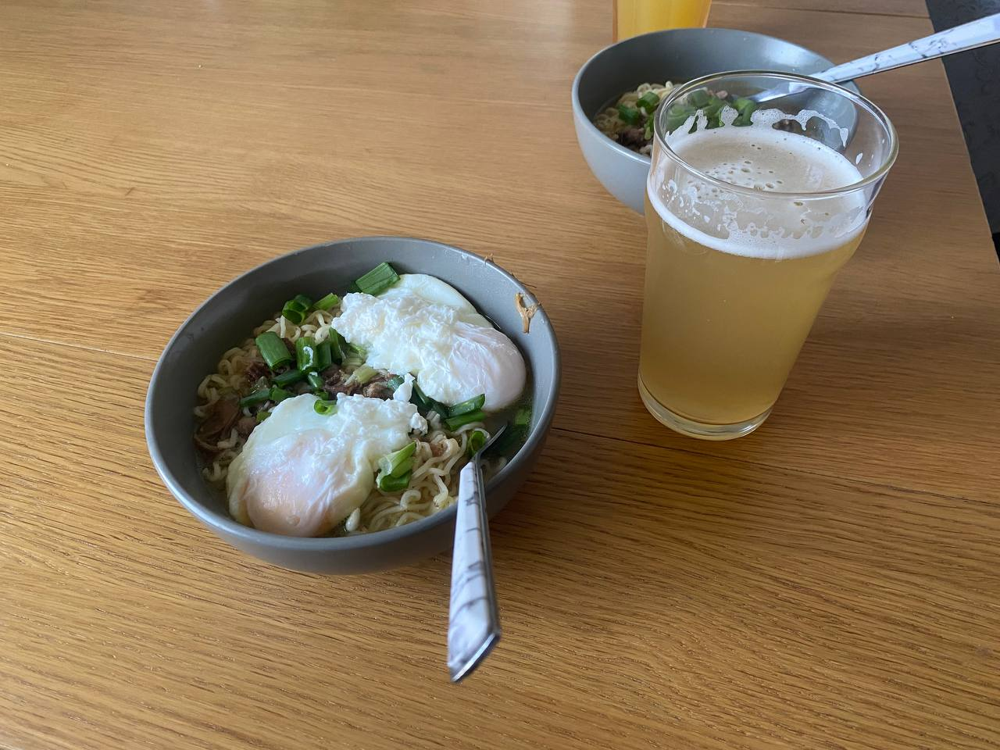

+++
title = 'Рецепт улучшенной лапши быстрого приготовления'
date = 2025-06-06T22:16:15+03:00
draft = false
+++

Тест

Иногда хочется чего-то горячего, сытного и несложного. Чтобы не стоять у плиты часами, а за 10–15 минут собрать тёплую тарелку с ароматным бульоном, мясом, зеленью и лапшой. Этот рецепт — как раз такой случай.

Мы возьмём обычную лапшу быстрого приготовления и превратим её в домашний супчик с тушёнкой, зелёным луком и, если захочешь, яйцом пашот. Получится нечто среднее между раменом и солдатским обедом — просто, вкусно, по-домашнему. Особенно приятно готовить в одной сковородке: меньше посуды, меньше суеты, больше удовольствия.

Сохраняй, пробуй и адаптируй под себя — можно обойтись без яиц, добавить овощи из холодильника или поиграть со специями. Ниже — пошаговая инструкция.

## Ингредиенты на одну порцию:

| Ингредиент                                                        | Количество                                            |
| ----------------------------------------------------------------- | ----------------------------------------------------- |
| Пачка лапши быстрого приготовления                                | 1 шт                                                  |
| Специи из пачки                                                   | 1/3 или 1/2                                           |
| Тушенка говядина                                                  | 3-5 столовых ложек                                    |
| Зеленый лук                                                       | 2 шт                                                  |
| Зубчик чеснока (по желанию)                                       | 1 шт                                                  |
| Соевый соус. Или можно немного лимонного сока или капельку уксуса | 1 чайная ложка                                        |
| Вода питьевая                                                     | 300-350 (можно чуть больше для более жидкого бульона) |
| Яйца (по желанию)                                                 | 1 шт                                                  |
| Масло растительное или сливочное                                  | пару ложек на сковородку                              |
| Кукуруза из банки или тертую морковь (по желанию)                 | 2-3 столовые ложки                                    |

## Готовка по шагам
### 🔥 1. Зажарка ключ к вкусному бульону
1. Разогрей сковородку, добавь немного масла.
2. Выложи тушёнку, разомни её вилкой или ложкой.
   Здесь главное не добавить слишком много жира. Но если добавил то на пункте 2.1 потребуется больше воды, чтобы компенсировать.
3. Обжарь 2–3 минуты. Пока не пойдет мясной аромат.
4. Добавь мелко нарезанный чеснок, белую часть зелёного лука, тертую морковь (по желанию) и обжарь ещё немного.

> Это даст основу вкуса бульону, мясную и ароматную.

### 💧 2. Заливаем воду — варим лапшу
1. Добавь примерно 350–400 мл воды прямо в сковороду.
2. Ждём, пока закипит.
3. Положи лапшу (можно слегка разломить, если хочешь). Не готовь лапшу слишком долго, а то развариться!
4. Добавь приправу из пачки, но не всю — сначала половину, а потом пробуешь по вкусу. Либо вместо готовой приправы можно использовать:
	- ½ ч. ложки **кунжутного масла** или растительного,
	- ¼ ч. ложки **сахара**,
	- Немного **имбиря** (порошкового или свежего),
	- Щепотка **чили** (по желанию),
	- ½ ч. ложки **уксуса** (рисового или обычного) — даст кислинку.
5. Капни немного соевого соуса (если есть) — даст глубину.
### 🍳 3. Добавляем яйцо пашот (по желанию)

1. Вбей яйцо прямо в кипящий бульон.
    - Хочешь — не мешай: получится целое яйцо, как в рамене.
    - Хочешь — размешай, будет супчик в стиле «яичного облака».
2. Готовим 2-3 минуты.

>Или можно сварить яйцо пашот отдельно в кастрюле. Если не все любят яйца. Для этого нужно:
>1. Разогреть воду до состояния, когда она почти кипит, но не бурлит.
>2. Добавить уксус 1 столовую ложку, чтобы белок не свернулся.
>3. Разбить яйцо(а) в отдельное блюдце
>4. Закрутить воронку с помощью ложки и аккуратно влить из блюдца яйцо(а)
>5. Готовить на таком же уровне огня в течение 2-3 минут.
>6. Достать ложкой с дырками и выложи в основное блюдо

### 🧄 4. Завершаем

- Добавляем в сковородку лапшу и варим до готовности (2–3 минуты).
- Пробуем — можно добавить оставшуюся приправу, по вкусу.
- В самом конце добавь зелёную часть лука и, если есть, каплю кунжутного масла или кусочек сливочного.

## 🍲 В итоге:

У тебя получится насыщенный мясной бульон, ароматный, с лапшой, яйцом и зеленью. Дешево и сердито💪.

> Это если что без алкогольное пиво :)
